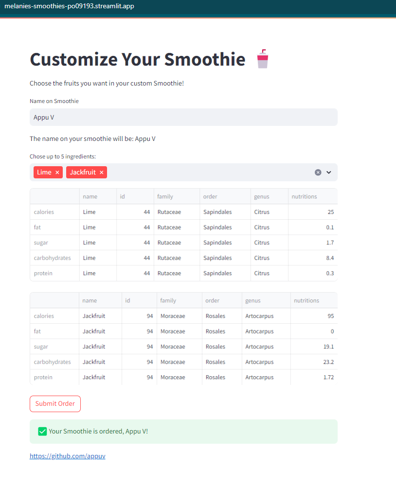

# Melanies Smoothies
Experience the integration of Snowflake's cloud data platform in a practical setting with this Streamlit app for ordering smoothies. Explore data-driven decision-making while learning key concepts in a fun, interactive way.

  )

# App 

# Course
[Badge 3: Data Application Builders Workshop](https://learn.snowflake.com/courses/course-v1:snowflake+ESS-DABW+B/course/)

### Note

The Streamlit app currently has connectivity issues due to an expired Snowflake subscription. As a result, certain features dependent on Snowflake will not be operational until the subscription is renewed. Please be aware of this limitation when using the app.
